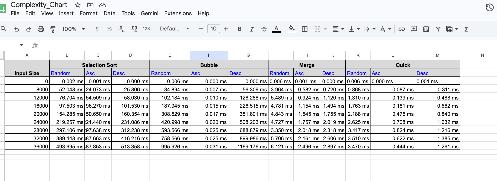
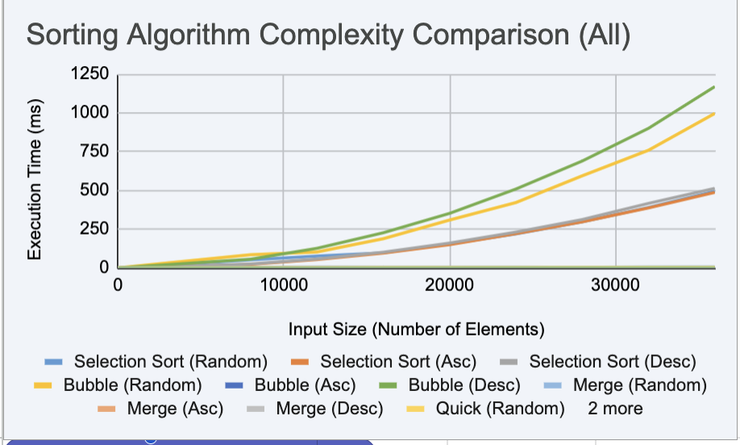

# Assignment 2 

## We have to compare sorting algos on different size of array in ascending,descending and random order and compare their analogies


### These are the sorting observation in table and chart view , code are listed below in this md file and also in the same repository in C_programs [look](../C_Programs/)






## My Observations : 
### Bubble sort :  It is very fast on already sorted array but fails when it is sorted in descending order, it takes the maximum time to sort this
#### Selection sort : it works the same for 3 types of arrays and no change is observed in this cause ot just compares in every iteration
#### Merge Sort stays remarkably flat and predictable across Random/Asc/Desc consistent with its guaranteed O(n log n) regardless of input arrangement
#### Quick sort : it is the best algo ,cause the choice of pivot is the main game that changes the output, 


## Code for bubble sort
```c
#include <stdbool.h>
#include <stdio.h>
#include <stdlib.h>
#include <time.h>

// Generates an array of random integers of given size.
int *generateArrayRandom(int size) {
  int *arr = malloc(size * sizeof(int));
  for (int i = 0; i < size; i++) {
    arr[i] = rand() % 100;
  }
  return arr;
};

int *generateIncreasing(int size){
  int number = 1;
  int* arr = malloc(size*sizeof(int));
  for(int i = 0 ; i < size ; i++){
    arr[i] = number;
    number++;
  }

  return arr;
}

int *generateDecreasing(int size){
  int number = size-1;
  int* arr = malloc(size*sizeof(int));
  for(int i = 0 ; i < size ; i++){
    arr[i] = number;
    number--;
  }

  return arr;
}

// Sorts the given array using Selection Sort.
void applyBubbleSort(int arr[], int size) {
  for (int i = 0; i < size - 1; i++) {
    bool swapped = false;
    for (int j = 0; j < size - i - 1; j++) {
      if (arr[j + 1] < arr[j]) {
        int temp = arr[j + 1];
        arr[j + 1] = arr[j];
        arr[j] = temp;
        swapped = true;
      }
    }

    if (!swapped)
      return;
  }
};

// Returns true if the array is sorted, otherwise false.
bool verifySort(int arr[], int size) {
  for (int i = 1; i < size; i++) {
    if (arr[i - 1] > arr[i]) {
      return false;
    }
  }
  return true;
};

void performSorting(int arr[], int size) {
  // Start timer
  clock_t start = clock();

  // Apply sorting algorithm
  applyBubbleSort(arr, size);

  // Stop timer
  clock_t end = clock();

  // Calculate execution time
  double executionTime = (double)(end - start) / CLOCKS_PER_SEC;

  //Verify correctness
  if (!verifySort(arr, size)) {
    printf("Sorting failed!\n");
    return;
  }

  printf("%.3f ms\n",executionTime * 1000);
  // printf("Execution Time: %.3f milliseconds\n", executionTime * 1000);
}
int main() {

  // Seed random number generator
  int sizes[] = {0, 8000, 12000, 16000, 20000, 24000, 28000,32000,36000};

  printf("Random numbers\n");
  for(int i = 0 ; i < sizeof(sizes)/sizeof(int) ; i++){
    int size = sizes[i];
    int* arr = generateArrayRandom(size);
    performSorting(arr, size);
    free(arr);
  }

    printf("Descending numbers\n");
   for(int i = 0 ; i < sizeof(sizes)/sizeof(int) ; i++){
    int size = sizes[i];
    int* arr = generateDecreasing(size);
    performSorting(arr, size);
    free(arr);
  }

  printf("Ascending numbers\n");
  for(int i = 0 ; i < sizeof(sizes)/sizeof(int); i++){
    int size = sizes[i];
    int* arr = generateIncreasing(size);
    performSorting(arr, size);
    free(arr);
  }

  return 0;
}

```

## Code for selection sort
```c
#include <stdbool.h>
#include <stdio.h>
#include <stdlib.h>
#include <time.h>

// Generates an array of random integers of given size.
int *generateArrayRandom(int size) {
  int *arr = malloc(size * sizeof(int));
  for (int i = 0; i < size; i++) {
    arr[i] = rand() % 100;
  }
  return arr;
};

int *generateIncreasing(int size){
  int number = 1;
  int* arr = malloc(size*sizeof(int));
  for(int i = 0 ; i < size ; i++){
    arr[i] = number;
    number++;
  }

  return arr;
}

int *generateDecreasing(int size){
  int number = size-1;
  int* arr = malloc(size*sizeof(int));
  for(int i = 0 ; i < size ; i++){
    arr[i] = number;
    number--;
  }

  return arr;
}

// Sorts the given array using Selection Sort.
void applySelectionSort(int arr[], int size) {
    for(int i = 0 ; i < size - 1 ; i++){
        int miniindex = i;
        for(int j = i+1 ; j < size ; j++){
            if(arr[j] < arr[miniindex]){
                miniindex = j;
            }
        }
        int temp = arr[miniindex];
        arr[miniindex] = arr[i];
        arr[i] = temp;
    }
};

// Returns true if the array is sorted, otherwise false.
bool verifySort(int arr[], int size) {
  for (int i = 1; i < size; i++) {
    if (arr[i - 1] > arr[i]) {
      return false;
    }
  }
  return true;
};

void performSorting(int arr[], int size) {
  // Start timer
  clock_t start = clock();

  // Apply sorting algorithm
  applySelectionSort(arr, size);

  // Stop timer
  clock_t end = clock();

  // Calculate execution time
  double executionTime = (double)(end - start) / CLOCKS_PER_SEC;

  //Verify correctness
  if (!verifySort(arr, size)) {
    printf("Sorting failed!\n");
    return;
  }

  printf("%.3f ms\n",executionTime * 1000);
  // printf("Execution Time: %.3f milliseconds\n", executionTime * 1000);
}
int main() {

  // Seed random number generator
  int sizes[] = {0, 8000, 12000, 16000, 20000, 24000, 28000,32000,36000};

  printf("Random numbers\n");
  for(int i = 0 ; i < sizeof(sizes)/sizeof(int) ; i++){
    int size = sizes[i];
    int* arr = generateArrayRandom(size);
    performSorting(arr, size);
    free(arr);
  }

    printf("Descending numbers\n");
   for(int i = 0 ; i < sizeof(sizes)/sizeof(int) ; i++){
    int size = sizes[i];
    int* arr = generateDecreasing(size);
    performSorting(arr, size);
    free(arr);
  }

  printf("Ascending numbers\n");
  for(int i = 0 ; i < sizeof(sizes)/sizeof(int); i++){
    int size = sizes[i];
    int* arr = generateIncreasing(size);
    performSorting(arr, size);
    free(arr);
  }

  return 0;
}

```

## code for quick sort
```c
#include <stdbool.h>
#include <stdio.h>
#include <stdlib.h>
#include <time.h>

// Generates an array of random integers of given size.
int *generateArrayRandom(int size) {
  int *arr = malloc(size * sizeof(int));
  for (int i = 0; i < size; i++) {
    arr[i] = rand() % 100;
  }
  return arr;
};

int *generateIncreasing(int size){
  int number = 1;
  int* arr = malloc(size*sizeof(int));
  for(int i = 0 ; i < size ; i++){
    arr[i] = number;
    number++;
  }

  return arr;
}

int *generateDecreasing(int size){
  int number = size-1;
  int* arr = malloc(size*sizeof(int));
  for(int i = 0 ; i < size ; i++){
    arr[i] = number;
    number--;
  }

  return arr;
}


int partition(int arr[], int low, int high) {
    int pivot = arr[low + (high - low) / 2];
    int i = low - 1;
    int j = high + 1;
    while (1) {
        do {
            i++;
        } while (arr[i] < pivot);
        do {
            j--;
        } while (arr[j] > pivot);
        if (i >= j)
            return j;
        int temp = arr[i];
        arr[i] = arr[j];
        arr[j] = temp;
    }
}

void Myquicksort(int arr[], int low, int high) {
    if (low < high) {
        int pi = partition(arr, low, high);
        Myquicksort(arr, low, pi);
        Myquicksort(arr, pi + 1, high);
    }
}

// Sorts the given array using Quick Sort.
void applyQuickSort(int arr[], int size) {
    if (size <= 0) return;
    Myquicksort(arr, 0, size - 1);
};

// Returns true if the array is sorted, otherwise false.
bool verifySort(int arr[], int size) {
  for (int i = 1; i < size; i++) {
    if (arr[i - 1] > arr[i]) {
      return false;
    }
  }
  return true;
};

void performSorting(int arr[], int size) {
  // Start timer
  clock_t start = clock();

  // Apply sorting algorithm
  applyQuickSort(arr, size);

  // Stop timer
  clock_t end = clock();

  // Calculate execution time
  double executionTime = (double)(end - start) / CLOCKS_PER_SEC;

  //Verify correctness
  if (!verifySort(arr, size)) {
    printf("Sorting failed!\n");
    return;
  }

  printf("%.3f ms\n",executionTime * 1000);
  // printf("Execution Time: %.3f milliseconds\n", executionTime * 1000);
}
int main() {

  // Seed random number generator
  int sizes[] = {0, 8000, 12000, 16000, 20000, 24000, 28000,32000,36000};

  printf("Random numbers\n");
  for(int i = 0 ; i < sizeof(sizes)/sizeof(int) ; i++){
    int size = sizes[i];
    int* arr = generateArrayRandom(size);
    performSorting(arr, size);
    free(arr);
  }

    printf("Descending numbers\n");
   for(int i = 0 ; i < sizeof(sizes)/sizeof(int) ; i++){
    int size = sizes[i];
    int* arr = generateDecreasing(size);
    performSorting(arr, size);
    free(arr);
  }

  printf("Ascending numbers\n");
  for(int i = 0 ; i < sizeof(sizes)/sizeof(int); i++){
    int size = sizes[i];
    int* arr = generateIncreasing(size);
    performSorting(arr, size);
    free(arr);
  }

  return 0;
}

```

## Code for merge sort
```c
#include <stdbool.h>
#include <stdio.h>
#include <stdlib.h>
#include <time.h>

// Generates an array of random integers of given size.
int *generateArrayRandom(int size) {
  int *arr = malloc(size * sizeof(int));
  for (int i = 0; i < size; i++) {
    arr[i] = rand() % 100;
  }
  return arr;
};

int *generateIncreasing(int size){
  int number = 1;
  int* arr = malloc(size*sizeof(int));
  for(int i = 0 ; i < size ; i++){
    arr[i] = number;
    number++;
  }

  return arr;
}

int *generateDecreasing(int size){
  int number = size-1;
  int* arr = malloc(size*sizeof(int));
  for(int i = 0 ; i < size ; i++){
    arr[i] = number;
    number--;
  }

  return arr;
}

void merge(int arr[],int left,int right,int mid){
    int n1 = mid - left + 1;
    int n2 = right - mid;

    int *lArr = malloc(n1*sizeof(int));
    int *rArr = malloc(n2*sizeof(int));

    for(int i = 0 ; i < n1 ; i++){
        lArr[i] = arr[left + i];
    }

    for(int j = 0 ; j < n2 ; j++){
        rArr[j] = arr[mid + 1 + j];
    }

    int i = 0 , j = 0 , k = left;
    while(i < n1 && j < n2){
        if(lArr[i] <= rArr[j]){
            arr[k] = lArr[i];
            i++;
        }else{
            arr[k] = rArr[j];
            j++;
        }
        k++;
    }

    while(i < n1){
        arr[k] = lArr[i];
        i++;
        k++;
    }

    while(j < n2){
        arr[k] = rArr[j];
        j++;
        k++;
    }

    free(lArr);
    free(rArr);
}
void Mymergesort(int arr[],int left,int right){

    if(left < right){
        int mid = left + (right - left)/2;
        Mymergesort(arr,left,mid);
        Mymergesort(arr,mid+1,right);
        merge(arr,left,right,mid);
    }

}
// Sorts the given array using merge Sort.
void applyMergeSort(int arr[], int size) {
    if(size <= 0) return;
    Mymergesort(arr,0,size-1);
};

// Returns true if the array is sorted, otherwise false.
bool verifySort(int arr[], int size) {
  for (int i = 1; i < size; i++) {
    if (arr[i - 1] > arr[i]) {
      return false;
    }
  }
  return true;
};

void performSorting(int arr[], int size) {
  // Start timer
  clock_t start = clock();

  // Apply sorting algorithm
  applyMergeSort(arr, size);

  // Stop timer
  clock_t end = clock();

  // Calculate execution time
  double executionTime = (double)(end - start) / CLOCKS_PER_SEC;

  //Verify correctness
  if (!verifySort(arr, size)) {
    printf("Sorting failed!\n");
    return;
  }

  printf("%.3f ms\n",executionTime * 1000);
  // printf("Execution Time: %.3f milliseconds\n", executionTime * 1000);
}
int main() {

  // Seed random number generator
  int sizes[] = {0, 8000, 12000, 16000, 20000, 24000, 28000,32000,36000};

  printf("Random numbers\n");
  for(int i = 0 ; i < sizeof(sizes)/sizeof(int) ; i++){
    int size = sizes[i];
    int* arr = generateArrayRandom(size);
    performSorting(arr, size);
    free(arr);
  }

    printf("Descending numbers\n");
   for(int i = 0 ; i < sizeof(sizes)/sizeof(int) ; i++){
    int size = sizes[i];
    int* arr = generateDecreasing(size);
    performSorting(arr, size);
    free(arr);
  }

  printf("Ascending numbers\n");
  for(int i = 0 ; i < sizeof(sizes)/sizeof(int); i++){
    int size = sizes[i];
    int* arr = generateIncreasing(size);
    performSorting(arr, size);
    free(arr);
  }

  return 0;
}

```